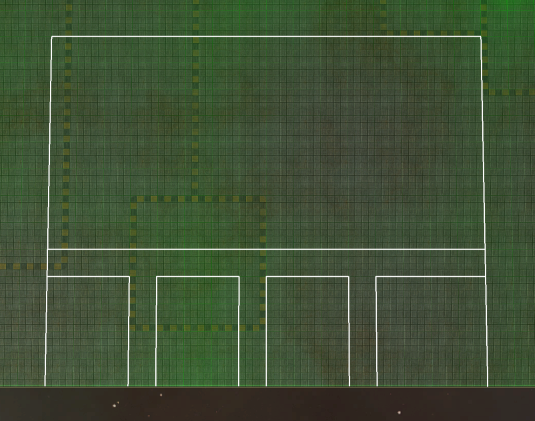

# Auto Base Grid Drawer Widget for Beyond All Reason

This widget displays a customizable base grid overlay aligned with the map terrain and camera orientation. It's designed to assist players in planning and placing base structures efficiently.

---

## 📦 Features

- 🎯 **Camera-Aligned Grid**: Automatically orients the grid based on the current camera direction.
- 🧱 **Custom Grid Shape**: Define arbitrary grid patterns using a simple 2D table.
- ✏️ **Grid Preview**: Real-time line preview rendered beneath the mouse cursor.
- 🖱️ **Mouse-Based Positioning**: Grid follows the terrain under the mouse.
- 🎨 **Color and Style Configuration**: Easily change colors, line widths, and elevation.
- 🔀 **Multi Layouts Support**: Supports switching between multiple base layout designs.
---

## Grid Builder Helper Page 
👉 [Open Grid Builder Page](https://gdevalpha.github.io/Auto-Base-Grid-Drawer-Widget-Grid-Layout-Builder/)

## 📦 Installation

To install the **Auto Base Grid Drawer** widget:

1. **Download the Widget**  
   Save the `auto_base_grid_drawer.lua` file into your BAR widget folder: Beyond-All-Reason/LuaUI/Widgets/

2. **Create your Base Layout**  
   Open the `auto_base_grid_drawer.lua` in any text editor and modify grid to change the grid layout. Refer Grid Definition for grid codes.
   local grid = { 
                    { 3 , 0 ,0 ,2 , 0, 0 ,1 },
                    { 0 , 0 ,0 ,0 , 0, 0 ,0 }
                } 

3. **Enable the Widget In-Game**  
- Press **F11** in-game to open the **Widget Menu**.
- Look for **Auto Base Grid Drawer**.
- Click to enable it.

## 🎮 Controls

| Key Combination | Action             |
|-----------------|--------------------|
| `Ctrl + Alt + A` | Toggle animated grid preview mode |
| `Ctrl + Alt + Q` | Place static grid lines onto map |
| `Ctrl + Alt + Z` | Flip Layout Horizontally (will cause issue when grid code is 3) |
| `Ctrl + Alt + X` | Switch to the next Base Layout in the list |
---


## Preview Mode
Preview The base grid before drawing. Preview will move with mouse 


## Base Grid Draw - Mid Base Layout



## Base Grid Draw - Corner Base Layout


## 📐 Grid Definition

The grid layout is defined in a 2D Lua table using simple numeric codes to specify where lines should appear.

Each cell in the table represents a tile, and the value indicates which lines (if any) should be drawn on that tile.

NOTE: Grid lines are drawn from left to right. To add vertical line on the right most edge of your layout you will need to add an addition column in grid. 
If you have a 16 block grid layout you will need 17 entries per row.


### 🔢 Legend

| Value | Meaning                            |
|-------|-------------------------------------|
| `0`   | No line                             |
| `1`   | Horizontal line only                |
| `2`   | Vertical line only                  |
| `3`   | Both horizontal and vertical lines  |

---


### 🧱 Example Grid

```lua
local grid = {
  {3, 1, 1, 1, 2},
  {2, 0, 0, 0, 2},
  {2, 0, 3, 0, 2},
  {2, 0, 0, 0, 2},
  {2, 2, 2, 2, 2}
}
```

### 🔀 Multi Layout Support

Easily define and include your own base layouts by adding them to the list of supported grid configurations.

```lua
-- Define your own custom layout and add it to the list
local gridLayouts = { yourCustomLayout, midLayout, corneLayout }
```

## 🛠️ Debugging Grid Layout changes

You can make changes to the widget even during a game but you will have to update the widget to reflect the new changes.

1. Go to Settings > Custom  > Look for **Auto Base Grid Drawer** disable and re enable it.

2. Click F11 to open the Widget Menu >  Look for **Auto Base Grid Drawer** disable and re enable it.

3. In in-game chat type /luaui reload (takes some time to reload) 

## 🛠️ Configuration

Other parameters that can be modified.

```lua
local tileSize = 192 -- Size of each grid tile in map units
local glLineColor = {1, 1, 0}          -- Animated grid line color (RGB)
local glPreviewLineColor = {1, 1, 1, 0.5} -- Preview grid line color (RGBA)
local elevationGL = 2                  -- Height offset above terrain
local lineWidth_GL = 2                 -- Width of animated lines
local previewLineWidth_GL = 1.5        -- Width of preview grid
